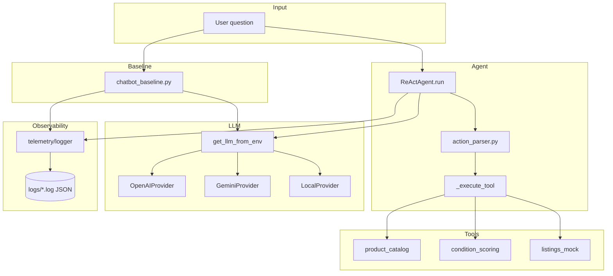

# Project Overview — Day 3: Chatbot vs ReAct Agent

## 1. Tổng quan

| | |
|---|---|
| **Tên dự án** | Day-3-Lab-Chatbot-vs-react-agent |
| **Khóa học** | Agentic AI — Phase 3 (Lab 3, Industry Edition) |
| **Mục tiêu học thuật** | So sánh **LLM chatbot một lần** với **ReAct agent** (Thought → Action → Observation) có tool và telemetry |
| **Sản phẩm team v1** | **PriceCheck Agent** — ước lượng giá bán lại đồ cũ tại VN từ tên SP + mô tả tình trạng |
| **Team** | @hanhvs · @0infinitive0 |
| **Môi trường làm việc** | Local + Google Colab (`notebooks/Lab3_v1_PriceAgent.ipynb`) |

Dự án được thiết kế như **production prototype**: tách LLM provider, log JSON có cấu trúc, và extension point cho tools — không chỉ “script chạy một lần”.

---

## 2. Vấn đề cần giải quyết

Người dùng hỏi dạng:

> *"Tôi có iPhone 13 128GB, pin 88%, màn ok, đủ hộp — giá thị trường bao nhiêu?"*

| Cách tiếp cận | Hành vi | Hạn chế |
|---------------|---------|---------|
| **Chatbot baseline** | Một lần gọi LLM, trả lời trực tiếp | Dễ đoán số, khó truy vết nguồn, sai trên câu nhiều bước |
| **ReAct agent** | Suy luận từng bước, gọi tool, đọc Observation | Cần parse output LLM, giới hạn `max_steps`, phụ thuộc mô tả tool |

Lab yêu cầu **đo lường và phân tích** (logs, so sánh chatbot vs agent), không chỉ “chạy được”.

---

## 3. Kiến trúc hệ thống



### Luồng ReAct (PriceCheck v1)

1. `normalize_product` — chuẩn hóa tên sản phẩm (catalog mock)
2. `get_reference_price` — giá tham chiếu mới (VND)
3. `score_condition` — tier tình trạng + hệ số khấu hao
4. `search_comparable_listings` — giá tin tương đương (mock marketplace)
5. `Final Answer` — khoảng giá + gợi ý đăng (tiếng Việt)

---

## 4. Cấu trúc thư mục

```
Day-3-Lab-Chatbot-vs-react-agent/
├── src/
│   ├── agent/
│   │   ├── agent.py              # ReAct loop, system prompt, tool dispatch
│   │   └── action_parser.py      # Parse Thought / Action / Final Answer
│   ├── chatbot/
│   │   └── chatbot_baseline.py   # Baseline không tool (so sánh)
│   ├── core/
│   │   ├── llm_provider.py       # Abstract interface
│   │   ├── openai_provider.py
│   │   ├── gemini_provider.py
│   │   ├── local_provider.py     # Phi-3 GGUF (CPU)
│   │   └── llm_factory.py        # get_llm_from_env() — Colab / .env
│   ├── tools/
│   │   ├── __init__.py             # TOOL_SPECS metadata
│   │   ├── product_catalog.py      # @hanhvs — 18 SP mock VN
│   │   ├── condition_scoring.py    # @0infinitive0 (planned)
│   │   └── listings_mock.py        # @0infinitive0 (planned)
│   └── telemetry/
│       ├── logger.py               # JSON logs → logs/
│       └── metrics.py              # Cost/token (skeleton, bonus)
├── notebooks/
│   └── Lab3_v1_PriceAgent.ipynb  # Colab chung (cells theo owner)
├── tests/
│   ├── test_product_catalog.py
│   ├── test_action_parser.py
│   └── test_local.py
├── docs/
│   ├── PROJECT_OVERVIEW.md       # File này
│   └── V1_TASK_PLAN_COLAB.md       # Chia task team v1
├── report/                       # Template báo cáo nhóm / cá nhân
├── run_hanhvs_demo.py            # Demo local: chatbot + agent
├── logs/                         # Runtime (gitignored)
├── .env.example
├── README.md
├── SCORING.md
├── EVALUATION.md
└── INSTRUCTOR_GUIDE.md
```

---

## 5. Thành phần chính

### 5.1 LLM layer (`src/core/`)

- **`LLMProvider`**: contract `generate()` / `stream()` + usage + latency.
- **Implementations**: OpenAI, Gemini, Local (llama-cpp).
- **`get_llm_from_env()`**: đọc `DEFAULT_PROVIDER`, `DEFAULT_MODEL`, API keys từ `.env` — dùng chung Colab và script local.

### 5.2 Chatbot baseline (`src/chatbot/`)

- Cùng persona tư vấn giá đồ cũ VN.
- **Không** gọi tool → baseline để so trong báo cáo và cell Colab `03_chatbot_demo`.

### 5.3 ReAct agent (`src/agent/`)

- **`ReActAgent`**: vòng lặp tối đa `max_steps` (mặc định 6).
- **Telemetry**: `AGENT_START`, `AGENT_STEP`, `TOOL_CALL`, `AGENT_END`.
- **Parser**: regex + `ast` cho `Action: tool(args)`.
- **Tool dispatch**: catalog tools + optional import partner modules.

### 5.4 Tools (`src/tools/`)

| Tool | Owner | Trạng thái v1 |
|------|--------|----------------|
| `normalize_product` | @hanhvs | Done |
| `get_reference_price` | @hanhvs | Done |
| `score_condition` | @0infinitive0 | Planned |
| `search_comparable_listings` | @0infinitive0 | Planned |

Catalog mock: điện thoại, laptop, máy ảnh, tablet, gaming, v.v. (~18 mục, giá VND tham chiếu).

### 5.5 Observability (`src/telemetry/`)

- Log dạng JSON lines trong `logs/YYYY-MM-DD.log`.
- Phục vụ RCA (parse lỗi, chọn sai tool, vượt `max_steps`) — xem `EVALUATION.md`.

---

## 6. Cấu hình môi trường

Sao chép `.env.example` → `.env`:

| Biến | Mô tả |
|------|--------|
| `DEFAULT_PROVIDER` | `openai` \| `google` \| `local` |
| `DEFAULT_MODEL` | vd. `gpt-4o`, `gemini-1.5-flash` |
| `OPENAI_API_KEY` | Khi dùng OpenAI |
| `GEMINI_API_KEY` | Khi dùng Gemini |
| `LOCAL_MODEL_PATH` | Đường dẫn file `.gguf` khi `local` |

**Không bắt buộc** dùng local — chọn **một** provider có key/model là đủ.

---

## 7. Chạy dự án

### Cài đặt

```bash
cp .env.example .env
# Điền API key
pip install -r requirements.txt
```

### Test không cần API

```bash
python -c "from src.tools.product_catalog import normalize_product; print(normalize_product('iphone 13 128gb'))"
```

### Demo chatbot + agent (cần API)

```bash
python run_hanhvs_demo.py
```

### Colab

1. Mở `notebooks/Lab3_v1_PriceAgent.ipynb`
2. Cell `00_setup`: pip, secrets `OPENAI_API_KEY`
3. Cell `01_imports` / `03_chatbot_demo` (@hanhvs)
4. Cell `04` / `05` sau khi partner merge tools

### Provider local (tùy chọn)

Xem `README.md` — tải Phi-3 GGUF vào `models/`, set `DEFAULT_PROVIDER=local`.

---

## 8. Tài liệu liên quan

| Tài liệu | Nội dung |
|----------|----------|
| [README.md](../README.md) | Setup nhanh, mục tiêu lab gốc |
| [V1_TASK_PLAN_COLAB.md](./V1_TASK_PLAN_COLAB.md) | Chia task @hanhvs / @0infinitive0, DoD v1 |
| [SCORING.md](../SCORING.md) | Rubric chấm điểm (nhóm + cá nhân) |
| [EVALUATION.md](../EVALUATION.md) | Metrics: token, latency, loop count |
| [INSTRUCTOR_GUIDE.md](../INSTRUCTOR_GUIDE.md) | Timeline 4h, tips giảng viên |
| [report/](../report/) | Template group / individual report |

---

## 9. Trạng thái triển khai (v1)

| Hạng mục | Trạng thái |
|----------|------------|
| Chatbot baseline | Done |
| ReAct loop + parser + logging | Done |
| Catalog tools (2/4) | Done |
| Condition + listings tools | Partner |
| Colab notebook (cells 00–03) | Done |
| Colab agent demo + compare table | Ghép team |
| Group / individual report | Chưa nộp |
| `metrics.py` pricing thật | Bonus / v2 |

---

## 10. Roadmap ngắn

| Phiên bản | Nội dung |
|-----------|----------|
| **v1** | 4 tool mock, chatbot vs agent, Colab, trace JSON |
| **v2** | Sửa lỗi từ RCA, retry/guardrail, prompt/tool spec v2 |
| **Bonus** | Token cost trong `metrics.py`, thêm tool, ablation prompt |

---

## 11. Điểm then chốt (takeaways)

1. **Chatbot** phù hợp Q&A đơn giản; **agent** phù hợp chuỗi tra cứu có cấu trúc.
2. **Tool description** quyết định LLM chọn tool đúng hay không.
3. **Log JSON** là nguồn sự thật khi debug — ưu tiên đọc trace hơn đoán prompt.
4. **Provider abstraction** giúp đổi model/API mà không đụng logic agent.

---

*Cập nhật: 2026-06-01 — PriceCheck Agent v1, team @hanhvs · @0infinitive0*
