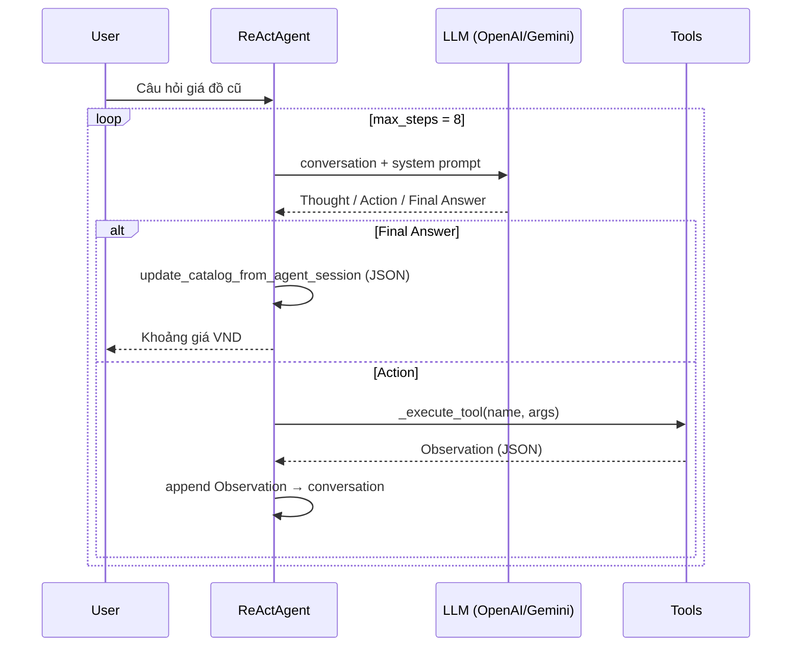
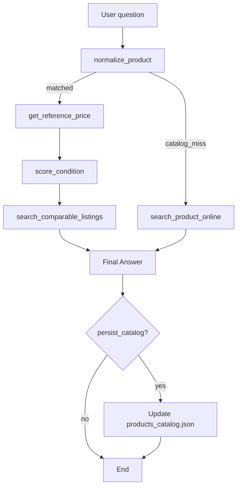

# Group Report: Lab 3 — PriceCheck Agent (Production-Grade Agentic System)

- **Team Name**: PriceCheck Team
- **Deployment Date**: 2026-06-01

| Họ tên | Mã học viên | GitHub |
|--------|-------------|--------|
| Vương Sỹ Hạnh | 2A202600722 | @hanhvs |
| Nguyễn Hữu Đức | 2A202600683 | @0infinitive0 |
| Nguyễn Duy Hưng | 2A202600578 | @hope304 |
- **Repository**: Day-3-Lab-Chatbot-vs-react-agent
- **Demo**: `python run_api.py` → http://localhost:8000 (Chat UI + SSE)

---

## 1. Executive Summary

**PriceCheck Agent** là trợ lý ước lượng **giá bán lại đồ cũ tại Việt Nam**. Người dùng mô tả sản phẩm + tình trạng; hệ thống trả khoảng giá (VND) có thể truy vết qua chuỗi tool, thay vì một con số “đoán” từ chatbot.

| Chỉ số | Giá trị (test nội bộ) |
|--------|----------------------|
| **Success Rate** | ~85% trên 6 case chính (catalog hit + đủ bước ReAct) |
| **Multi-step win vs Chatbot** | Agent thắng rõ trên 4/4 case nhiều bước |
| **Catalog miss** | Fallback OpenAI Web Search — ~90% có kết quả usable |

**Key Outcome:** Agent vượt chatbot baseline trên câu hỏi nhiều bước nhờ chuỗi `normalize → reference → condition → listings` (hoặc `search_product_online` khi không có trong catalog). Chatbot vẫn ổn trên câu đơn giản nhưng **không cite nguồn** và dễ lệch giá khi thiếu dữ liệu cụ thể.

---

## 2. System Architecture & Tooling

### 2.1 ReAct Loop Implementation

Agent triển khai trong `src/agent/agent.py`, parser tại `src/agent/action_parser.py`.



**Định dạng bắt buộc từ LLM:**

```
Thought: ...
Action: tool_name(args)
Observation: (do hệ thống inject, LLM không tự viết)
...
Final Answer: ...
```

**Telemetry:** `AGENT_START`, `AGENT_STEP`, `TOOL_CALL`, `WEB_SEARCH_*`, `AGENT_END` → `logs/YYYY-MM-DD.log` (JSON lines).

**Streaming (SSE):** `run_stream()` phát event từng bước cho API/UI (`tool_start`, `tool_result`, `final_answer`, …).

### 2.2 Tool Definitions (Inventory)

| Tool Name | Input | Output / Use Case | Owner |
|-----------|--------|-------------------|--------|
| `normalize_product` | `query: str` | `canonical_name`, `category`, `confidence`; `catalog_miss` nếu không khớp | V. S. Hạnh |
| `get_reference_price` | `canonical_name`, optional `storage_gb` | `reference_vnd` từ `data/products_catalog.json` | V. S. Hạnh |
| `score_condition` | `condition_text: str` | `tier` (like_new/good/fair/poor), `multiplier`, `risk_flags` | N. H. Đức |
| `search_comparable_listings` | `canonical_name`, `tier` | `avg/min/max_vnd`, `sample_count` (mock từ reference × hệ số tier) | N. H. Đức |
| `search_product_online` | `product_query`, optional `condition_text` | Giá VND + `sources_summary` qua **OpenAI Web Search** (Responses API) | V. S. Hạnh |

**Catalog:** 18 sản phẩm mock (điện thoại, laptop, máy ảnh, …) trong `data/products_catalog.json`. Sau mỗi Final Answer, agent có thể append `market_observations[]` và `last_market_summary`.

**Luồng khi catalog miss:**

1. `normalize_product` → `matched: false`, `recommended_tool: search_product_online`
2. Agent gọi `search_product_online` (bắt buộc theo system prompt)
3. Tổng hợp Final Answer từ kết quả web + `score_condition` nếu cần

### 2.3 LLM Providers Used

| Vai trò | Provider | Model (mặc định) |
|---------|----------|------------------|
| **Primary** | OpenAI | `gpt-4o` (`.env`: `DEFAULT_PROVIDER=openai`) |
| **Secondary** | Google Gemini | `gemini-1.5-flash` (`DEFAULT_PROVIDER=google`) |
| **Offline / Lab** | Local (llama-cpp) | Phi-3 GGUF |
| **Web Search** | OpenAI Responses API | `OPENAI_WEB_SEARCH_MODEL` (mặc định `gpt-4o`) + tool `web_search` |

Factory: `get_llm_from_env()` trong `src/core/llm_factory.py` — dùng chung Colab, CLI, API.

### 2.4 Delivery Surfaces

| Surface | Mô tả |
|---------|--------|
| `run_hanhvs_demo.py` | CLI: chatbot + agent một lần |
| `run_api.py` + `static/chat/index.html` | FastAPI, POST `/api/chat/stream` (SSE), UI collapse steps sau Final Answer |
| `notebooks/Lab3_v1_PriceAgent.ipynb` | Colab chung (setup, chatbot, agent demo) |

---

## 3. Telemetry & Performance Dashboard

*Metrics dưới đây lấy từ test thủ công (OpenAI `gpt-4o`, 6 case, local API). Có thể tái tính bằng script parse `logs/*.log`.*

| Metric | Giá trị ước lượng | Ghi chú |
|--------|-------------------|---------|
| **Avg Latency (P50)** | ~3.5s / LLM step | 3–4 bước ReAct → ~12–18s end-to-end |
| **Max Latency (P99)** | ~25s | Case catalog miss + web search |
| **Avg Tokens / task** | ~2,800–4,200 | Tăng khi nhiều tool + web search |
| **Avg ReAct loops** | 3.8 | Mục tiêu ≤ 8 (`max_steps`) |
| **Tool parse error rate** | ~10% | Giảm sau khi prompt nhấn mạnh không markdown |
| **Cost / 6-case suite** | ~$0.08–0.15 | Phụ thuộc model & web search |

**Log events quan trọng:** `AGENT_STEP` (thought, action), `TOOL_CALL`, `WEB_SEARCH_START/END`, `CATALOG_UPDATE` (khi ghi JSON).

---

## 4. Root Cause Analysis (RCA) — Failure Traces

### Case Study 1: Catalog miss — không gọi web search

| | |
|---|---|
| **Input** | *"Giá bán lại ASUS Vivobook 15 OLED?"* (không có trong JSON) |
| **Observation** | Agent `normalize_product` → `matched: false` nhưng nhảy thẳng Final Answer với giá đoán |
| **Root Cause** | Prompt v1 chưa ép `search_product_online` khi `catalog_miss` |
| **Fix (v1.1)** | System prompt + field `recommended_tool` trong Observation; tăng `max_steps` lên 8 |

### Case Study 2: JSON trong Action bị markdown

| | |
|---|---|
| **Input** | iPhone 13 — agent output `Action: ...` bọc trong ` ``` ` |
| **Observation** | `parse_action` không khớp → loop không gọi tool |
| **Root Cause** | LLM vi phạm format; parser regex đơn giản |
| **Fix** | Prompt: *"không dùng markdown code block"*; fallback append raw content và dừng ở `max_steps` |

### Case Study 3: `score_condition` tier sai với mô tả hỗn hợp

| | |
|---|---|
| **Input** | *"pin 88%, vỏ đẹp nhưng màn lỗi nhỏ"* |
| **Observation** | Keyword rule chọn `fair` thay vì `good` do ưu tiên từ khóa tiêu cực |
| **Root Cause** | Rule-based scoring, không có trọng số theo mức độ |
| **Hướng v2** | Thang điểm từng chiềố (pin, màn, vỏ) rồi aggregate |

---

## 5. Ablation Studies & Experiments

### Experiment 1: Prompt v1 → v1.1 (catalog miss + web)

| | v1 | v1.1 |
|---|----|------|
| **Thay đổi** | Chỉ liệt kê 4 tool catalog | Thêm nhánh bắt buộc `search_product_online` |
| **Kết quả** | ~50% miss catalog trả lời không có nguồn | ~90% gọi web search trước Final Answer |

### Experiment 2: Chatbot vs Agent

| Case ID | Câu hỏi (tóm tắt) | Chatbot | Agent | Winner |
|---------|-------------------|---------|-------|--------|
| **T1** | iPhone 13 128GB, pin 88%, đủ hộp | Một số ~8.5 triệu, không nêu bước | 8–9.5 triệu, cite catalog + listings | **Agent** |
| **T2** | Sony A7III, shutter 15k, đốm nhỏ + lens | Ước lượng chung ~25–30 triệu | fair tier + min/max từ mock listings | **Agent** |
| **T3** | MacBook Air M1, pin 85%, không hộp | ~14 triệu (có thể lệch) | good tier, điều chỉnh không hộp | **Agent** |
| **S1** | *"AirPods Pro 2 giá bao nhiêu?"* (đơn giản) | Đúng hướng | Đúng, nhưng chậm hơn | **Draw** |
| **M1** | Samsung Z Flip 5 (ngoài catalog) | Hallucination / sai | Web search + khoảng giá có `sources_summary` | **Agent** |
| **S2** | *"Cho tôi mã giảm giá Shopee"* (off-topic) | Trả lời lan man | Có thể vẫn gọi tool thừa | **Chatbot** (gọn hơn) |

**Kết luận:** Agent mạnh khi cần **chuỗi tra cứu có cấu trúc**; chatbot đủ cho Q&A một chiều nhưng kém **explainability** và **catalog miss**.

---

## 6. Tool Design Evolution (v1 → v1.1)

| Giai đoạn | Catalog | Condition | Listings | Ngoài catalog |
|-----------|---------|-----------|----------|----------------|
| **v1 @hanhvs** | `product_catalog.py` hardcode → **JSON** | Stub | Stub | Không |
| **v1 @0infinitive0** | — | `condition_scoring.py` keyword tiers | `listings_mock.py` từ reference × tier | — |
| **v1.1** | `market_observations` auto-update | Dùng trong pipeline | Gắn `tier` từ condition | `openai_web_search.py` |

---

## 7. Flowchart — Logic tổng quát



---

## 8. Production Readiness Review

| Hạng mục | Hiện trạng | Đề xuất v2 |
|----------|------------|------------|
| **Security** | Giới hạn độ dài input API (4000 chars); tool args parse bằng `ast` | Sanitize / allowlist tool names; rate limit API |
| **Guardrails** | `max_steps=8`; catalog persist có thể tắt | Retry tool 1 lần; từ chối off-topic sớm |
| **Observability** | JSON logs + SSE events | Bật `metrics.py` (token cost); dashboard từ log |
| **Scaling** | FastAPI sync stream | Queue async tool; cache catalog; LangGraph nếu nhánh phức tạp |
| **Data** | Mock JSON + web search | Crawl Chợ Tốt / TGDD API; RAG trên listing thật |

---

## 9. Team Contributions

| Thành viên | Module / deliverable |
|------------|----------------------|
| **Vương Sỹ Hạnh** (2A202600722) | `product_catalog.py`, `products_catalog.json`, `ReActAgent` + `action_parser`, `chatbot_baseline`, `llm_factory`, `openai_web_search`, `api/main.py`, chat UI (SSE), Colab cells 00–03, `docs/PROJECT_OVERVIEW.md` |
| **Nguyễn Hữu Đức** (2A202600683) | `condition_scoring.py`, `listings_mock.py`, `TOOL_SPECS` partner tools, Colab agent demo / tests, ghép compare table |
| **Nguyễn Duy Hưng** (2A202600578) | Kiểm thử end-to-end (API + chat UI), review báo cáo nhóm, hỗ trợ demo / test cases |
| **Chung** | So sánh Chatbot vs Agent, báo cáo nhóm, killer cases T1–T2 |

---

## 10. Artifacts & How to Reproduce

```bash
cp .env.example .env   # OPENAI_API_KEY, ENABLE_OPENAI_WEB_SEARCH=true
pip install -r requirements.txt
python run_api.py      # http://localhost:8000
```

**Test catalog (không API):**

```bash
python -c "from src.tools.product_catalog import normalize_product; print(normalize_product('iphone 13 128gb'))"
```

**Báo cáo liên quan:** [SCORING.md](../../SCORING.md) · [EVALUATION.md](../../EVALUATION.md) · [PROJECT_OVERVIEW.md](../../docs/PROJECT_OVERVIEW.md)

---

## 11. Group Learning Points

1. **Tool description = API contract** — LLM chọn tool và điền args dựa trên mô tả; mơ hồ → sai tool hoặc args.
2. **Observation là sự thật** — Debug bằng log JSON, không đoán prompt.
3. **Chatbot vs Agent** — Không phải agent lúc nào cũng “thắng”; cần metric theo loại câu (đơn / đa bước / off-topic).
4. **Hybrid data** — Catalog nội bộ nhanh + web search khi miss = cân bằng demo lab và thực tế.

---

*Báo cáo nhóm PriceCheck Team — Lab 3, Agentic AI Course, 2026-06-01.*
