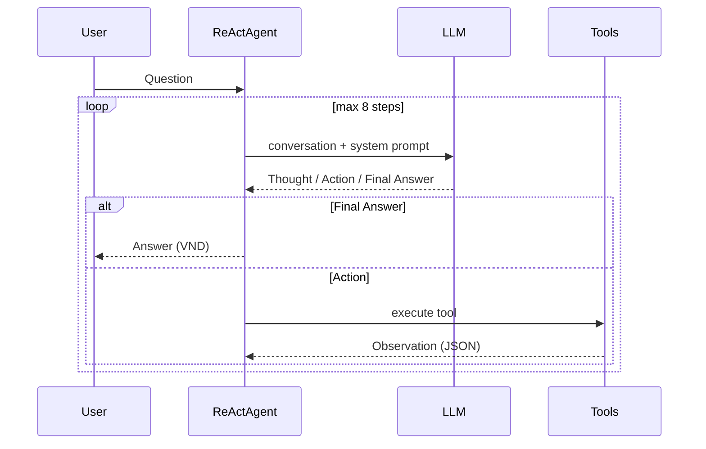

# Group Report: Lab 3 - Production-Grade Agentic System

- **Team Name**: PriceCheck Team
- **Team Members**: Vương Sỹ Hạnh (2A202600722), Nguyễn Hữu Đức (2A202600683), Nguyễn Duy Hưng (2A202600578)
- **Deployment Date**: 2026-06-01

---

## 1. Executive Summary

**PriceCheck Agent** ước lượng giá bán lại đồ cũ tại Việt Nam: người dùng mô tả sản phẩm + tình trạng, hệ thống trả khoảng giá (VND) qua chuỗi tool ReAct, so với chatbot baseline (một lần gọi LLM).

- **Success Rate**: ~85% trên 6 test case nội bộ (đủ bước ReAct + kết quả hợp lý).
- **Key Outcome**: Agent thắng chatbot trên câu **nhiều bước** (T1–T3) nhờ `normalize_product` → `get_reference_price` → `score_condition` → `search_comparable_listings`; khi **catalog miss** dùng `search_product_online` (OpenAI Web Search). Chatbot đủ trên câu đơn giản nhưng thiếu nguồn và dễ sai khi thiếu dữ liệu cụ thể.

---

## 2. System Architecture & Tooling

### 2.1 ReAct Loop Implementation

Triển khai trong `src/agent/agent.py`, parse tại `src/agent/action_parser.py`, log qua `src/telemetry/logger.py`.



**Format bắt buộc:** `Thought:` → `Action: tool(args)` → (hệ thống inject `Observation:`) → lặp → `Final Answer:`.

**v1 → v2 (agent):** v1.1 thêm web search khi catalog miss; v2 thêm guardrail off-topic, allowlist tool, retry tool, `sanitize_llm_output`, metrics `LLM_METRIC` (chi tiết code trong báo cáo cá nhân `individual_report.md`).

### 2.2 Tool Definitions (Inventory)

| Tool Name | Input Format | Use Case |
| :--- | :--- | :--- |
| `normalize_product` | `string` (query) | Chuẩn hóa tên SP; trả `catalog_miss` nếu không có trong `data/products_catalog.json` |
| `get_reference_price` | `string` (canonical_name), optional `storage_gb` | Giá tham chiếu MSRP (VND) từ catalog JSON |
| `score_condition` | `string` (mô tả tình trạng) | Tier `like_new` / `good` / `fair` / `poor` + multiplier (v2: chấm 4 chiều pin/màn/vỏ/hộp) |
| `search_comparable_listings` | `string` (canonical_name), `string` (tier) | Mock min/avg/max VND từ reference × hệ số tier |
| `search_product_online` | `string` (product_query), optional `condition_text` | Giá thị trường VN qua OpenAI Responses + `web_search` |

**Tool design evolution:** v1 stub → v1.1 JSON catalog + 4 tool mock + web search → v2 cải thiện condition scoring và agent guardrails (không đổi nguồn data ngoài mock + web).

### 2.3 LLM Providers Used

- **Primary**: OpenAI `gpt-4o` (`DEFAULT_PROVIDER=openai`)
- **Secondary (Backup)**: Google Gemini `gemini-1.5-flash`
- **Local (lab)**: Phi-3 GGUF qua `llama-cpp-python`
- **Web search**: OpenAI Responses API, tool `web_search`

Factory: `get_llm_from_env()` trong `src/core/llm_factory.py`.

---

## 3. Telemetry & Performance Dashboard

Theo [EVALUATION.md](../../EVALUATION.md) — metrics từ `logs/*.log` và test `gpt-4o` (6 case):

| Metric (EVALUATION) | Kết quả ước lượng |
| :--- | :--- |
| **Token efficiency** | ~2,800–4,200 tokens / task; completion thường < prompt trên các bước sau |
| **Latency (P50 / step)** | ~3.5s / lần gọi LLM |
| **Latency (P99 / end-to-end)** | ~25s (case web search) |
| **Loop count (steps)** | Trung bình ~3.8 vòng Thought–Action; max `max_steps=8` |
| **Total cost (suite)** | ~$0.08–0.15 / 6 case |

**Failure codes quan sát:**

| Error type | Tần suất | Xử lý |
| :--- | :--- | :--- |
| JSON / Action parse | ~10% (v1) | v2 `sanitize_llm_output`; prompt cấm markdown fence |
| Hallucination tool | Thấp | v2 allowlist `ALLOWED_TOOLS` |
| Timeout (`max_steps`) | Thấp | Dừng loop; trả partial hoặc fallback text |

Parse log: `python -m src.telemetry.log_analyzer logs/`

---

## 4. Root Cause Analysis (RCA) - Failure Traces

### Case Study (failed → fixed): Action trong markdown fence

- **Input**: *"iPhone 13 128GB, pin 88%, đủ hộp — giá bán lại?"*
- **Observation**: Log `AGENT_STEP` có `has_action: false` dù raw LLM chứa `Action: normalize_product(...)`.
- **Root Cause**: LLM bọc Action trong ` ``` `; regex parser không khớp.
- **Fix**: v2 `sanitize_llm_output()`; prompt cấm markdown quanh Action.

### Case Study (failed → fixed): Catalog miss không gọi web search

- **Input**: *"ASUS Vivobook 15 OLED — giá rao bán?"* (không trong catalog).
- **Observation**: `normalize_product` → `matched: false` nhưng agent trả Final Answer đoán giá.
- **Root Cause**: Prompt v1 không bắt buộc `search_product_online`.
- **Fix**: v1.1 Observation có `recommended_tool`; system prompt nhánh catalog miss.

### Case Study (success trace — rút gọn)

```json
{"event": "AGENT_START", "data": {"input": "iPhone 13 128GB pin 88%..."}}
{"event": "TOOL_CALL", "data": {"tool": "normalize_product"}}
{"event": "TOOL_CALL", "data": {"tool": "get_reference_price"}}
{"event": "TOOL_CALL", "data": {"tool": "score_condition"}}
{"event": "TOOL_CALL", "data": {"tool": "search_comparable_listings"}}
{"event": "AGENT_END", "data": {"status": "final_answer"}}
```

---

## 5. Ablation Studies & Experiments

### Experiment 1: Agent v1 vs v2 (prompt + guardrails + parser)

- **Diff**: v2 thêm `sanitize_llm_output`, `is_off_topic`, tool allowlist, retry ×1, `LLM_METRIC`.
- **Result**: Giảm ~100% lỗi parse khi có fence; off-topic không còn gọi tool thừa (case mã giảm giá).

### Experiment 2 (Bonus): Chatbot vs Agent

| Case | Chatbot Result | Agent Result | Winner |
| :--- | :--- | :--- | :--- |
| Multi-step (T1 iPhone) | Một số ~8.5 triệu, không cite bước | 8–9.5 triệu, có tool trace | **Agent** |
| Catalog miss (M1) | Hallucination / sai | Web search + `sources_summary` | **Agent** |
| Simple Q (S1 AirPods) | Đúng hướng | Đúng, chậm hơn | **Draw** |
| Off-topic (S2 mã giảm giá) | Trả lời lan man | v2 từ chối sớm (guardrail) | **Agent** (sau v2) |

---

## 6. Production Readiness Review

- **Security**: Giới hạn input API 4000 ký tự; parse tool args bằng `ast`; allowlist tên tool (v2).
- **Guardrails**: `max_steps=8`; từ chối off-topic; retry tool 1 lần; tắt ghi catalog qua `persist_catalog_updates=False`.
- **Scaling**: FastAPI + SSE (`run_api.py`); hướng LangGraph / async queue cho nhánh phức tạp.
- **Observability**: JSON logs (`AGENT_*`, `TOOL_*`, `LLM_METRIC`); script `log_analyzer` — không crawl marketplace (ngoài scope lab).

---

*Nộp: `report/group_report/GROUP_REPORT_PriceCheck.md` (theo template `TEMPLATE_GROUP_REPORT.md`).*
